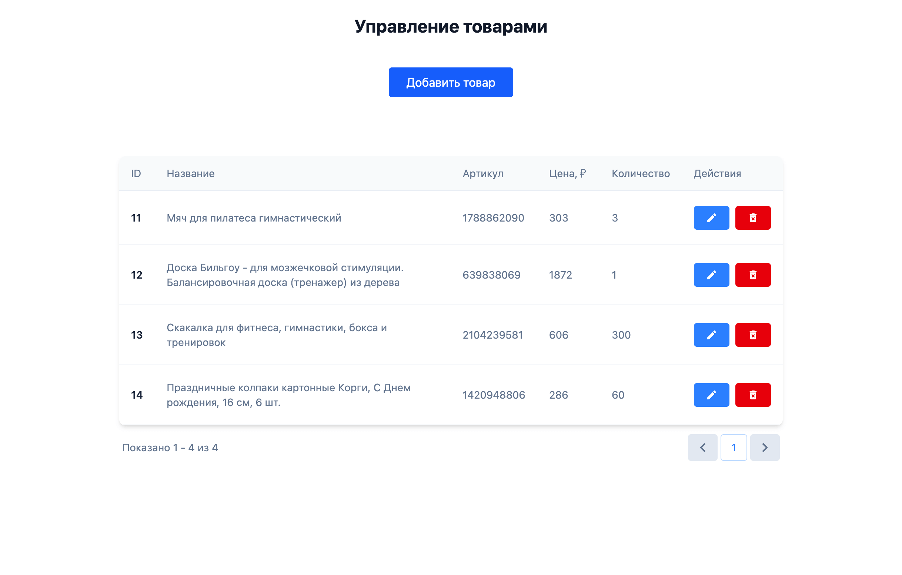

# Учет товаров

Простое приложение для учета товаров с базовым CRUD-функционалом (получение, добавление, удаление и редактирование товаров), пагинацией (разделением на страницы) и минималистичным дизайном.

## Как запустить

[Сервер](https://github.com/anvass/sms-product-list/blob/main/server/README.md) 
[Клиент](https://github.com/anvass/sms-product-list/blob/main/client/README.md)

## Технологии

Frontend: 

Backend: 

Инфраструктура: 

